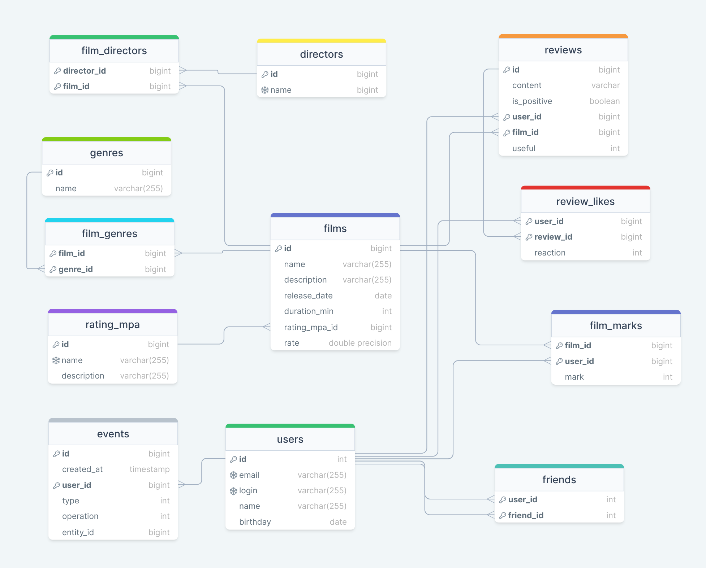

# REST-API Filmorate

## Сервис оценки фильмов
Позволяет пользователям ставить оценки фильмам, оставлять отзывы и реакции на них, добавлять других пользователей в 
друзья и просматривать новостную ленту.

## ER-диаграмма

## Команда
### тимлид :muscle:
@polinuxxx Казичкина Полина
### разработчики :man_technologist:
@yelgazin Елгазин Максим

@PavelIgK Кистенев Павел

@romilMasnaviev Маснавиев Ромиль

@dmiheev Михеев Дмитрий

## features

- [x] https://github.com/polinuxxx/java-filmorate/issues/26 @polinuxxx
- [x] https://github.com/polinuxxx/java-filmorate/issues/28 @dmiheev
- [x] https://github.com/polinuxxx/java-filmorate/issues/29 @PavelIgK
- [x] https://github.com/polinuxxx/java-filmorate/issues/30 @yelgazin
- [x] https://github.com/polinuxxx/java-filmorate/issues/31 @PavelIgK @polinuxxx
- [x] https://github.com/polinuxxx/java-filmorate/issues/32 @romilMasnaviev
- [x] https://github.com/polinuxxx/java-filmorate/issues/33 @romilMasnaviev
- [x] https://github.com/polinuxxx/java-filmorate/issues/34 @PavelIgK

## Технологический стек

